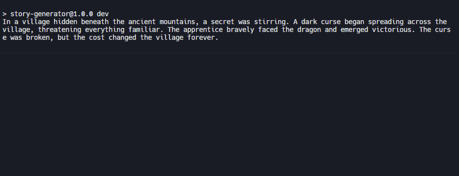
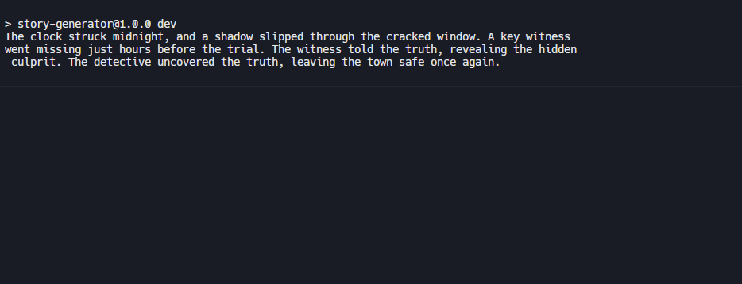

<h1>Story Generator</h1>

<h4>An interactive terminal application that generates random short stories with varying prompts and narrative structures.</h4>

<h2>Features</h2>

- <h4>Random Story Generation</h4>
- <h4>Multiple Prompts & Genres</h4>
- <h4>Narrative Variations</h4>
- <h4>Self-Contained Stories</h4>
- <h4>Replayable Outputs</h4>

<h2>Technologies</h2>

<h2>Screenshots</h2>

